# AIP-C01 Decision Flowcharts

Generated from 900 practice questions. Use these diagrams to quickly identify the right AWS service for common GenAI scenarios.

## Table of Contents
1. [Quick Decision Matrix](#quick-decision-matrix)
2. [Vector Store Selection](#vector-store-selection)
3. [Endpoint Selection](#endpoint-selection)
4. [PII Handling](#pii-handling)
5. [Cost Optimization](#cost-optimization)
6. [Service Relationships](#service-relationships)
7. [Domain Coverage](#domain-coverage)

---

## Quick Decision Matrix

The most important decision patterns distilled from all questions:

```mermaid
flowchart TB
    subgraph "🎯 Quick Decision Matrix"
        direction TB
        
        subgraph "Latency Requirements"
            L1["< 100ms → Real-time endpoint + Priority tier"]
            L2["< 500ms → Standard tier or Provisioned"]
            L3["Seconds OK → Flex tier or Serverless"]
            L4["No SLA → Batch inference (50% savings)"]
        end
        
        subgraph "Scale Requirements"
            S1["Variable traffic → Auto-scaling + Scale-to-zero"]
            S2["Consistent high → Provisioned Throughput"]
            S3["Spiky → SQS buffer + Lambda"]
            S4["GPU needed → SageMaker Real-time (not Lambda!)"]
        end
        
        subgraph "Data Requirements"
            D1["PII + Recovery → ANONYMIZE + Tokenization"]
            D2["PII + Block → BLOCK mode"]
            D3["Embedding change → Must re-index!"]
            D4["Multi-region → Cross-region inference"]
        end
        
        subgraph "Cost Optimization"
            C1["Repeated prompts → Prompt caching (90% off)"]
            C2["Batch OK → Batch inference (50% off)"]
            C3["Large vectors → Titan 256-dim (75% less)"]
            C4["Archive data → S3 Vectors (90% less)"]
        end
    end
    
    style L1 fill:#FFE4E1
    style L2 fill:#FFE4E1
    style L3 fill:#FFE4E1
    style L4 fill:#FFE4E1
    style S1 fill:#E0FFE0
    style S2 fill:#E0FFE0
    style S3 fill:#E0FFE0
    style S4 fill:#E0FFE0
    style D1 fill:#E0E0FF
    style D2 fill:#E0E0FF
    style D3 fill:#E0E0FF
    style D4 fill:#E0E0FF
    style C1 fill:#FFFFD0
    style C2 fill:#FFFFD0
    style C3 fill:#FFFFD0
    style C4 fill:#FFFFD0
```

---

## Vector Store Selection

When to use which vector database:

### Key Takeaways:
- **S3 Vectors**: Best for large archives with infrequent updates (90% cost reduction)
- **OpenSearch Serverless**: Best for auto-scaling without infrastructure management
- **ElastiCache**: Best for sub-millisecond latency with real-time updates
- **Aurora PostgreSQL**: Best when you need ACID transactions + vector search
- **Neptune Analytics**: Best when you need graph relationships + vector search

---

## Endpoint Selection

Choosing the right inference endpoint:

### Key Takeaways:
- **GPU Required?** → Only SageMaker Real-time supports GPU (NOT Lambda, NOT Serverless)
- **Variable Traffic?** → Use scale-to-zero feature (new in 2024!)
- **Batch OK?** → Always use Batch Inference for 50% savings
- **Mixed Workloads?** → Use Service Tiers (Priority/Standard/Flex)

---

## PII Handling

Guardrails configuration for sensitive data:

```mermaid
flowchart TD
    START[PII Handling Strategy] --> Q1{Need to Recover PII?}
    
    Q1 -->|Yes| TOK[Guardrails ANONYMIZE<br/>+ Tokenization Service<br/>Store PII mappings]
    Q1 -->|No| Q2{Context Important?}
    
    Q2 -->|Yes, keep conversation| ANON[Guardrails ANONYMIZE<br/>Replace with *email* <br/>Conversation continues]
    Q2 -->|No, block entirely| BLOCK[Guardrails BLOCK<br/>Stop request<br/>Return error message]
    
    TOK --> TRACK[Enable Guardrail Tracing<br/>CloudWatch InvocationsIntervened<br/>GuardrailPolicyType dimension]
    ANON --> TRACK
    BLOCK --> TRACK
    
    subgraph "Anti-Patterns"
        AP1[❌ Post-process with Comprehend<br/>PII already logged]
        AP2[❌ Client-side redaction<br/>Security risk]
        AP3[❌ Regex confidence scores<br/>Guardrails don't return scores]
    end
    
    style TOK fill:#90EE90
    style ANON fill:#87CEEB
    style BLOCK fill:#FFB6C1
    style TRACK fill:#DDA0DD
    style AP1 fill:#FF6B6B
    style AP2 fill:#FF6B6B
    style AP3 fill:#FF6B6B
```

### Key Takeaways:
- **ANONYMIZE (Mask)**: Replaces PII with placeholders, conversation continues
- **BLOCK**: Stops entire request, returns error
- **Tokenization**: Use with ANONYMIZE when you need to recover original PII
- **Never**: Post-process with Comprehend (PII already logged!) or client-side redaction

---

## Cost Optimization

Reducing GenAI costs:

### Key Takeaways:
- **Batch Inference**: 50% cost reduction for non-real-time workloads
- **Prompt Caching**: 90% discount on cached tokens, 85% latency improvement
- **Service Tiers**: Match workload urgency to tier (Priority > Standard > Flex)
- **Vector Dimensions**: Titan 256-dim maintains 97% accuracy with 75% less storage

---

## Service Relationships

How AWS services connect in GenAI architectures:

---

## Domain Coverage

Question distribution across exam domains:

---

## Anti-Patterns to Avoid

Common wrong answers from the questions:

| Scenario | Wrong Choice | Why It's Wrong |
|----------|--------------|----------------|
| GPU inference | Lambda | Lambda doesn't support GPU |
| PII logging | Comprehend post-process | PII already logged before detection |
| Async pattern | Step Functions with Agent | Agents can't integrate with Step Functions |
| Embedding change | Keep old vectors | Must re-index when embedding model changes |
| High latency tolerance | Priority tier | Wastes money - use Flex tier |
| Variable traffic | Fixed provisioned | Use auto-scaling or scale-to-zero |

---

*Generated from 900 AIP-C01 practice questions*
